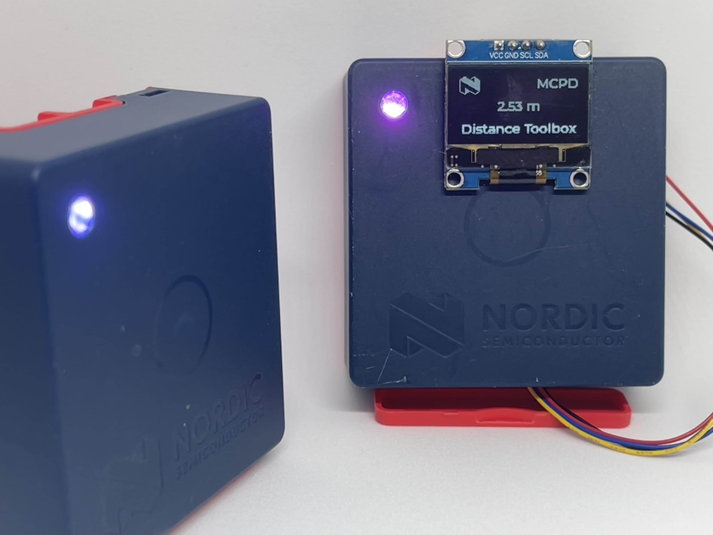

# Nordic Distance Toolbox Demo
## Supports Thingy53 with an external OLED connected via STEMMA port

  

## Demo setup
Program one Thingy53 with the initiator application. Connect an SSD1306 128x64 OLED to the STEMMA QT port of the Thingy53.  

Program up to 12 Thingy53s with the reflector application. The initiator should automatically begin ranging with first-come-first-served order. As ranging peers are cycled between, the initiator will change its LED's color to indicate which device is being ranged.

## Configuration options
The configuration options available are the same as in the "nrf_dm" with a few added options  

The initiator/reflector can be configured to default to RTT or MCPD ranging with "CONFIG_MCPD_DISTANCE" or "CONFIG_RTT_DISTANCE"  

The saturation and luminance of the indicator LED on both initiator and reflector can be configured with "CONFIG_INDICATOR_LED_SATURATION" and "CONFIG_INDICATOR_LED_LUMINANCE"  

To configure the timeout for a ranging peer, change "CONFIG_DM_PEER_DELAY_MS"  

To adjust the ranging offset for more accurate ranging, change "CONFIG_DM_DISTANCE_OFFSET_CM"  

